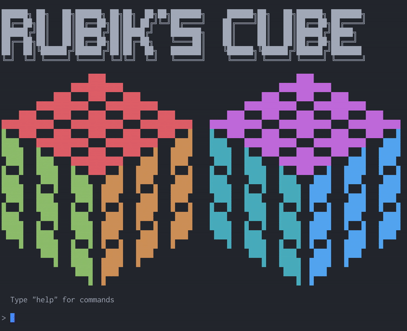
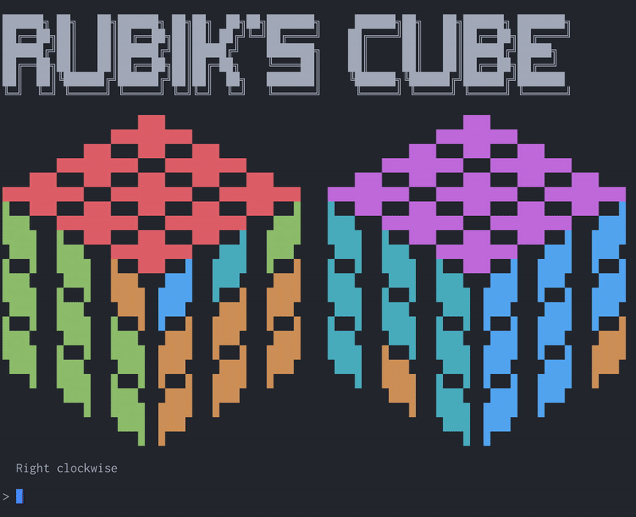

# Rubik's Cube

A casual command line game written in C. Tested on macOS only.

## Screenshot

## Commands

### Cube rotation (Case sensitive):

| Layer        | Clockwise | Anticlockwise | Remarks         |
|--------------|-----------|---------------|-----------------|
| **L**eft     | `L`       | `l`           |                 |
| **R**ight    | `R`       | `r`           |                 |
| **U**p       | `U`       | `u`           |                 |
| **D**own     | `D`       | `d`           |                 |
| **F**ront    | `F`       | `f`           |                 |
| **B**ack     | `B`       | `b`           |                 |
| **M**iddle   | `M`       | `b`           | Between L and R |
| **E**quator  | `E`       | `b`           | Between U and D |
| **S**tanding | `S`       | `b`           | Between F and B |
| Rotate **X** | `X`       | `b`           |                 |
| Rotate **Y** | `Y`       | `b`           |                 |
| Rotate **Z** | `Z`       | `b`           |                 |

### Others:

| Command | Description         |
|---------|---------------------|
| `solve` | Solves the cube     |
| `mix`   | Mixes the cube      |
| `help`  | Lists commands      |
| `exit`  | Terminates the game |
